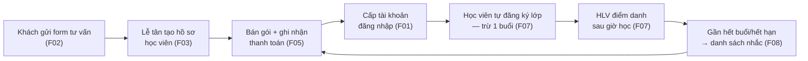
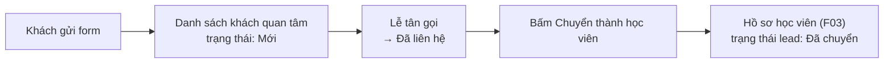
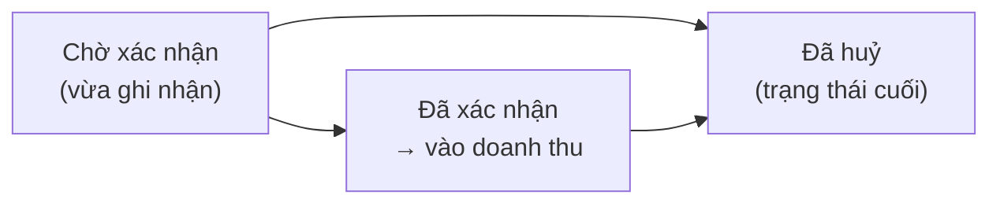

# Đặc tả tính năng — Pilates Studio

Tài liệu bàn giao. Mô tả **hệ thống làm được gì, ai dùng, màn hình trông ra sao,
bấm vào thì chuyện gì xảy ra**. Không có mã nguồn trong tài liệu này.

| Bạn là | Đọc phần nào |
|---|---|
| Chủ studio / khách hàng | "Tính năng" F01–F09: mục **Mục tiêu**, **Luồng dùng**, **Nghiệm thu** |
| BA / QA | Thêm mục **Trạng thái & thông báo** và phụ lục B |
| Frontend | Thêm khung màn hình + [`api-cho-frontend.md`](api-cho-frontend.md) |
| Backend | [`business-rules.md`](business-rules.md) là nguồn chuẩn, tài liệu này chỉ mô tả |

**Quy ước đọc khung màn hình:** các khung dưới đây là **bố cục thông tin**, không
phải bản thiết kế đồ hoạ. Chúng nói *màn hình có gì và xếp theo thứ tự nào*.
Hình thức cuối cùng theo hệ thiết kế Soul-1 ([`thiet-ke/`](thiet-ke/)).

> Ký hiệu: `[ Nút ]` · `( ) Chọn một` · `▸` mở rộng · `▪` mục danh sách ·
> `⋯` còn nữa · `⚠` cảnh báo hiện cho người dùng.

---

## Người dùng của hệ thống

| Vai | Là ai | Vào hệ thống để |
|---|---|---|
| **Khách ẩn danh** | Người vào website, chưa là học viên | Xem HLV, lịch lớp, bảng giá, gửi form tư vấn |
| **ADMIN** | Chủ studio | Toàn quyền: tài khoản, điều chỉnh buổi, xoá ảnh, báo cáo |
| **STAFF** | Lễ tân / nhân viên | Học viên, gói tập, thanh toán, lịch lớp, nhắc gia hạn, báo cáo |
| **TRAINER** | Huấn luyện viên | Xem lịch dạy của mình, điểm danh lớp mình dạy |
| **STUDENT** | Học viên | Xem lớp, tự đăng ký / hủy / đổi, xem số buổi còn lại, ảnh tiến trình |

**Ba giới hạn dễ bị hiểu nhầm — đã chốt với chủ dự án ngày 14/09/2026:**

1. **Chỉ học viên tự đăng ký lớp cho mình.** Lễ tân và HLV **không** đặt hộ.
2. **Không có hàng chờ.** Lớp đầy là từ chối; có người hủy thì ai vào trước được trước.
3. **Lễ tân không xem được ảnh tiến trình.** Chỉ ADMIN, HLV phụ trách, và chính học viên đó.

Bảng quyền đầy đủ: [`business-rules.md` §11](business-rules.md).

---

## Bản đồ tính năng

| Mã | Tính năng | Ai dùng chính |
|---|---|---|
| F01 | [Đăng nhập & tài khoản](#f01--đăng-nhập--tài-khoản) | Tất cả |
| F02 | [Website công khai & khách quan tâm](#f02--website-công-khai--khách-quan-tâm) | Khách ẩn danh, STAFF |
| F03 | [Quản lý học viên & ảnh tiến trình](#f03--quản-lý-học-viên--ảnh-tiến-trình) | STAFF |
| F04 | [Quản lý huấn luyện viên](#f04--quản-lý-huấn-luyện-viên) | STAFF, TRAINER |
| F05 | [Gói tập, sổ buổi & thanh toán](#f05--gói-tập-sổ-buổi--thanh-toán) | STAFF |
| F06 | [Lớp & lịch học](#f06--lớp--lịch-học) | STAFF |
| F07 | [Đăng ký, hủy, đổi lớp & điểm danh](#f07--đăng-ký-hủy-đổi-lớp--điểm-danh) | STUDENT, TRAINER |
| F08 | [Nhắc học viên sắp hết gói](#f08--nhắc-học-viên-sắp-hết-gói) | STAFF |
| F09 | [Báo cáo](#f09--báo-cáo) | ADMIN, STAFF |

**Vòng đời một học viên — xuyên suốt sáu tính năng:**



**Quy ước chung cho mọi màn hình:**

- Giờ luôn là **giờ studio** (`Asia/Ho_Chi_Minh`), kể cả khi máy người dùng ở múi giờ khác.
- **Ô chưa có số liệu để trống, không để `0`.** `0` nghĩa là "đã đếm và bằng không".
- Trạng thái không bao giờ **chỉ** mã hoá bằng màu — luôn kèm chữ hoặc ký hiệu.
- Mọi thông báo lỗi hiện **nguyên văn tiếng Việt do hệ thống trả về**, không tự dịch lại.
- Màn hình chính dùng được ở bề rộng **400px** (điện thoại).

---

## F01 · Đăng nhập & tài khoản

**Mục tiêu.** Mỗi người có đúng một tài khoản, đúng một vai, và mất quyền ngay
khi bị khoá.

**Không có chức năng tự đăng ký.** Học viên liên hệ studio → lễ tân tạo hồ sơ →
ADMIN cấp tài khoản gắn với hồ sơ đó. Đây là quyết định nghiệp vụ, không phải
thiếu sót: studio biết ai đang tập trước khi người đó có mật khẩu.

### Màn đăng nhập

```
┌──────────────────────────────────────────┐
│  PILATES STUDIO                          │
│                                          │
│  Email      [________________________]   │
│  Mật khẩu   [________________________]   │
│                                          │
│            [   Đăng nhập   ]             │
│            Quên mật khẩu?                │
│                                          │
│  ⚠ Email hoặc mật khẩu không đúng.       │
└──────────────────────────────────────────┘
```

Sau khi đăng nhập, hệ thống đọc vai và **đưa thẳng về màn chính của vai đó**:
ADMIN/STAFF → Bảng tổng hợp · TRAINER → Lịch dạy của tôi · STUDENT → Lịch của tôi.

### Luồng dùng

| # | Việc | Ai làm | Kết quả |
|---|---|---|---|
| 1 | Tạo tài khoản, chọn vai, chọn hồ sơ học viên/HLV | ADMIN | Tài khoản ở trạng thái **Chờ kích hoạt**, chưa có mật khẩu |
| 2 | Hệ thống gửi email đặt mật khẩu | tự động | Người dùng bấm liên kết, đặt mật khẩu, tài khoản **Đang hoạt động** |
| 3 | Quên mật khẩu → nhập email | bất kỳ | Luôn hiện **cùng một thông báo**, dù email có tồn tại hay không |
| 4 | Đổi mật khẩu | bất kỳ | **Bắt buộc nhập mật khẩu hiện tại**, kể cả ADMIN |
| 5 | Tự sửa tên / số điện thoại | bất kỳ | Hồ sơ học viên hoặc HLV liên kết được cập nhật theo |
| 6 | Khoá tài khoản | ADMIN | Người đó **bị đăng xuất khỏi mọi thiết bị ngay lập tức** |

Điểm 3 và 6 là yêu cầu bảo mật, không phải chi tiết kỹ thuật. Thông báo khác
nhau ở bước 3 sẽ biến màn "quên mật khẩu" thành công cụ dò xem ai là khách của
studio. Không có bước 6 thì "khoá tài khoản" chỉ chặn được lần đăng nhập sau,
còn phiên đang mở vẫn dùng tiếp.

### Trạng thái & thông báo

| Tình huống | Người dùng thấy |
|---|---|
| Sai mật khẩu nhiều lần | "Quá nhiều lần thử. Vui lòng thử lại sau **N** giây." |
| Tài khoản bị khoá | Không đăng nhập được, thông báo chung |
| Email đã có người dùng | "Email đã được sử dụng." khi ADMIN tạo tài khoản |
| Liên kết đặt mật khẩu hết hạn / đã dùng | Mời yêu cầu liên kết mới |

### Nghiệm thu

- [ ] Tài khoản mới nhận được email và đặt được mật khẩu, không ai phải đọc mật khẩu qua điện thoại.
- [ ] Khoá tài khoản → người đó thao tác tiếp bị đẩy về màn đăng nhập.
- [ ] Đăng nhập sai 5–10 lần bị chặn tạm thời, báo rõ còn bao lâu.
- [ ] Mỗi vai vào đúng màn chính của mình, không thấy menu của vai khác.

---

## F02 · Website công khai & khách quan tâm

**Mục tiêu.** Người chưa quen studio xem được HLV, lịch lớp, bảng giá, thông báo
— rồi để lại thông tin liên hệ.

### Khung trang công khai

```
┌─────────────────────────────────────────────────────────┐
│  PILATES STUDIO      Giới thiệu · Dịch vụ · HLV · Lịch  │
├─────────────────────────────────────────────────────────┤
│  [ Ảnh studio — đang chờ ]        ← nhãn nói thật khi   │
│                                     chưa có ảnh thật    │
│  Giới thiệu ngắn về studio                              │
├─────────────────────────────────────────────────────────┤
│  HUẤN LUYỆN VIÊN                                        │
│  ▪ [ảnh]  Tên HLV        ▪ [ảnh]  Tên HLV               │
│    Giới thiệu ngắn         Giới thiệu ngắn              │
├─────────────────────────────────────────────────────────┤
│  LỊCH LỚP                                               │
│  Thứ Hai 15/09                                          │
│    06:00–07:00   Group     HLV A        Còn chỗ         │
│    18:00–19:00   Private   HLV B        Đã đầy          │
├─────────────────────────────────────────────────────────┤
│  BẢNG GIÁ                                               │
│    Gói 10 buổi Group      1.500.000 đ                   │
│    Gói 10 buổi Private    — (chưa có giá)               │
├─────────────────────────────────────────────────────────┤
│  ĐỂ LẠI THÔNG TIN                                       │
│    Họ tên [__________]  Điện thoại [__________]         │
│    Nhu cầu [_______________________________]            │
│                              [ Gửi ]                    │
└─────────────────────────────────────────────────────────┘
```

**Bốn quyết định nội dung đã chốt** — áp cho cả nội dung nhân viên nhập sau khi
hệ thống chạy thật, hệ thống **từ chối lưu** nếu vi phạm:

| Không được xuất hiện | Vì sao |
|---|---|
| Chứng chỉ / bằng cấp / số năm kinh nghiệm HLV | Studio chưa cung cấp, không được suy đoán |
| Giờ mở cửa | Chưa ai xác nhận khung giờ nào là chính thức |
| Số liệu kinh doanh (doanh thu, tổng học viên, % tăng) | Không phải thông tin cho khách vãng lai |
| Cụm "tối đa 3 người mỗi lớp" | Con số của cơ sở khác, sai với studio này |

**Giá gói:** hiện giá **khi studio cung cấp**. Chưa có giá thì ô để trống kèm
nhãn — **không hiện `0 đ`**, vì `0 đ` là một lời nói sai chứ không phải chỗ trống.

**Lịch công khai chỉ hiện "Còn chỗ / Đã đầy"**, không hiện còn mấy chỗ và không
hiện tên người đã đăng ký.

### Khách quan tâm → học viên



### Nghiệm thu

- [ ] Khách gửi form thành công, lễ tân thấy ngay trong danh sách khách quan tâm.
- [ ] Rà thủ công toàn bộ trang công khai **sau khi nhập dữ liệu thật**: không mục nào trong bảng cấm xuất hiện.
- [ ] Ô chưa có dữ liệu có nhãn trung thực ("Ảnh studio — đang chờ"), không phải "Sắp ra mắt".
- [ ] Trang công khai không lộ số điện thoại HLV, không lộ danh sách người đăng ký.

---

## F03 · Quản lý học viên & ảnh tiến trình

**Mục tiêu.** Một chỗ duy nhất trả lời: người này còn bao nhiêu buổi, gói nào,
đã học những lớp nào, đã trả tiền chưa.

### Màn chi tiết học viên

```
┌────────────────────────────────────────────────────────────┐
│  ← Học viên /  Nguyễn Thị A                                │
│  0912 345 678 · a@email.com · Đang hoạt động               │
│                                                            │
│  Còn lại  14 buổi          ⚠ Sắp cần gia hạn               │
│                                                            │
│  Gói đang hoạt động                                        │
│  ▪ Gói 20 buổi Group   còn 14 buổi   hết hạn sau 22 ngày   │
├────────────────────────────────────────────────────────────┤
│  [ Gói tập ] [ Sổ buổi ] [ Lịch sử lớp ] [ Ảnh tiến trình ]│
│  ──────────────────────────────────────────────────────────│
│  (nội dung tab)                                            │
└────────────────────────────────────────────────────────────┘
```

| Tab | Nội dung |
|---|---|
| **Gói tập** | Mọi gói đã mua: loại lớp, số buổi còn, ngày bắt đầu/hết hạn, trạng thái |
| **Sổ buổi** | Từng dòng biến động buổi: ngày, lý do, `+`/`−`, số dư sau, ai thực hiện |
| **Lịch sử lớp** | Mọi lượt đăng ký kể cả đã hủy, kèm kết quả điểm danh |
| **Ảnh tiến trình** | Ảnh theo mốc thời gian — **ẩn hoàn toàn với lễ tân** |

**"Còn lại N buổi" chỉ tính gói đang hoạt động** — gói còn hạn cả về ngày và còn
buổi. Buổi của gói đã hết hạn **không bị thu hồi**, nhưng cũng không cộng vào con
số này. Nếu studio muốn gọi lại những người vừa hết hạn mà còn buổi, đó là một
danh sách riêng, hiện chưa thuộc phạm vi.

### Ảnh tiến trình — ai thấy gì

| | Xem | Tải lên | Xoá |
|---|:---:|:---:|:---:|
| ADMIN | ✓ | ✓ | ✓ |
| STAFF (lễ tân) | — | — | — |
| HLV đang dạy học viên đó | ✓ | ✓ | — |
| Chính học viên đó | ✓ | ✓ | — |

Xoá hẹp hơn xem vì **xoá là mất vĩnh viễn**: một lần bấm nhầm của học viên là mất
toạ độ so sánh của cả quá trình tập. Ảnh cơ thể còn được hệ thống **bóc sạch dữ
liệu vị trí GPS** trước khi lưu — máy ảnh điện thoại gắn kèm toạ độ nhà học viên
vào mỗi tấm ảnh.

**Tab ảnh tiến trình phải ẩn hẳn với lễ tân**, không phải hiện rồi báo "không có quyền".

### Nghiệm thu

- [ ] Lễ tân đăng nhập: **không nhìn thấy** tab ảnh tiến trình ở bất kỳ học viên nào.
- [ ] Học viên đăng nhập chỉ xem được hồ sơ của chính mình; đổi số trên đường dẫn không mở được hồ sơ người khác.
- [ ] Số buổi hiện trên đầu màn khớp với dòng cuối của tab Sổ buổi.
- [ ] Số điện thoại nhập có khoảng trắng (`0900 000 055`) vẫn bị chặn trùng với `0900000055`.

---

## F04 · Quản lý huấn luyện viên

**Mục tiêu.** Danh sách HLV để xếp lớp, và mỗi HLV tự xem được lịch dạy của mình.

```
┌──────────────────────────────┐   ┌────────────────────────────────────┐
│  HUẤN LUYỆN VIÊN    [+ Thêm] │   │  LỊCH DẠY CỦA TÔI    < Tuần 15/09 >│
│  ▪ HLV A   0912…   ✓ Hiện    │   │  T2 06:00 Group   4/6 người        │
│  ▪ HLV B   0913…   ✓ Hiện    │   │  T2 18:00 Private 2/2 người        │
│  ▪ HLV C   0914…   — Ẩn      │   │  T4 06:00 Group   1/6 người        │
└──────────────────────────────┘   └────────────────────────────────────┘
```

| Việc | Ai | Ghi chú |
|---|---|---|
| Thêm / sửa HLV, tải ảnh đại diện | STAFF, ADMIN | Ảnh dùng cả ở trang công khai |
| Ẩn HLV khỏi trang công khai | STAFF, ADMIN | Ẩn không xoá — lịch cũ vẫn tra được |
| Xem lịch dạy của mình | TRAINER | **Chỉ lớp mình dạy**, không thấy lớp HLV khác |
| Thống kê tháng của một HLV | STAFF, ADMIN | Số lớp, số lượt đăng ký, mức lấp đầy |

**HLV hiện không tự xem được thống kê tháng của chính mình** — đây là mặc định an
toàn đang chờ studio xác nhận (phụ lục C, câu 8).

**Giới thiệu HLV nhập ở đây sẽ lên trang công khai**, nên chịu quy tắc nội dung ở
F02: viết "10 năm kinh nghiệm" hay "chứng chỉ quốc tế" sẽ bị hệ thống từ chối lưu.

### Nghiệm thu

- [ ] HLV đăng nhập chỉ thấy lớp của mình, kể cả khi mở trực tiếp đường dẫn lớp của HLV khác.
- [ ] Ẩn một HLV → biến mất khỏi trang công khai, nhưng lịch dạy cũ vẫn còn tên.
- [ ] Số lớp ở thống kê tháng khớp với số lớp đếm trên lịch tuần.

---

## F05 · Gói tập, sổ buổi & thanh toán

**Mục tiêu.** Bán gói, theo dõi từng buổi tăng giảm, ghi nhận tiền — và luôn giải
thích được vì sao số buổi lại là con số đó.

### Ba khái niệm phải phân biệt

| | Là gì | Ví dụ |
|---|---|---|
| **Loại gói** | Mẫu gói studio bán | "Gói 20 buổi Group — 3 tháng — 2.500.000 đ" |
| **Gói của học viên** | Một lần bán cụ thể cho một người | "Gói 20 buổi Group của chị A, 01/09 → 30/11" |
| **Thanh toán** | Khoản tiền ghi nhận | "2.500.000 đ tiền mặt, chưa xác nhận" |

**Tiền và buổi là hai chuyện tách rời.** Bán gói là cộng buổi ngay để học viên tập
được; ghi nhận và xác nhận tiền là việc kế toán chạy sau. Chỉ khoản **đã xác nhận**
mới vào báo cáo doanh thu.

### Màn bán gói

```
┌──────────────────────────────────────────────────────────┐
│  BÁN GÓI                                                 │
│  Học viên   [ Nguyễn Thị A            ▾ ]                │
│  Loại gói   [ Gói 20 buổi Group       ▾ ]                │
│  Số buổi    [ 20 ]    Hiệu lực [01/09/2026]→[30/11/2026] │
│  Giá        [ 2.500.000 ]                                │
│                                                          │
│  ☑ Ghi nhận thanh toán ngay                              │
│     ( ) Tiền mặt   ( ) Chuyển khoản                      │
│                                                          │
│                         [ Huỷ ]  [ Bán gói ]             │
└──────────────────────────────────────────────────────────┘
```

### Sổ buổi — mỗi thay đổi là một dòng, không bao giờ sửa

```
┌────────────────────────────────────────────────────────────────────┐
│  SỔ BUỔI — Gói 20 buổi Group                        Còn lại: 14    │
│  Ngày         Lý do                     Buổi    Còn   Người làm    │
│  01/09 09:12  Bán gói                   +20      20   Lễ tân B     │
│  03/09 07:55  Đăng ký lớp 05/09 06:00    −1      19   Nguyễn A     │
│  04/09 20:10  Hủy đúng hạn lớp 05/09     +1      20   Nguyễn A     │
│  05/09 06:02  Đăng ký lớp 07/09 06:00    −1      19   Nguyễn A     │
│  ⋯                                                                 │
│  12/09 11:30  Điều chỉnh tay             +1      14   Admin        │
│               "Lớp 12/09 mất điện, trả buổi cho học viên"          │
└────────────────────────────────────────────────────────────────────┘
```

**Sổ buổi chỉ ghi thêm, không sửa và không xoá dòng nào.** Ghi sai thì ghi một
dòng đối ứng, và dòng sai vẫn nằm đó. Đây là lý do studio luôn trả lời được câu
"vì sao tôi bị trừ buổi này" bằng một dòng có ngày giờ và tên người thực hiện.

**Điều chỉnh tay là quyền riêng của ADMIN và bắt buộc nhập lý do.** Không nhập lý
do thì hệ thống không cho lưu — không phải cảnh báo, là chặn.

### Thanh toán — ba trạng thái



Mỗi lần chuyển trạng thái đều lưu **ai làm và lúc nào**; huỷ còn bắt buộc lý do.

**Huỷ một khoản thanh toán không phải lúc nào cũng được.** Hệ thống từ chối trong
hai trường hợp, và từ chối là đúng:

| Tình huống | Hệ thống làm gì |
|---|---|
| Gói chưa dùng buổi nào, mọi buổi đều đến từ chính lần bán này | Cho huỷ, thu hồi toàn bộ số buổi, gói chuyển sang **Đã huỷ** |
| Gói **đã dùng ít nhất 1 buổi** | ⚠ Từ chối, nêu rõ đã dùng bao nhiêu buổi |
| Gói còn buổi đến từ **nguồn khác** (gia hạn, điều chỉnh tay, nhập liệu đầu kỳ) | ⚠ Từ chối |

Lý do của dòng thứ ba: số buổi không gắn nhãn "thuộc khoản tiền nào". Nếu vẫn cho
huỷ, hệ thống sẽ thu hồi **cả số buổi studio vừa gia hạn và số buổi studio tự bù
cho học viên** — mất tài sản của người khác mà sổ sách vẫn cân. Cách xử lý đúng
trong hai trường hợp này là ADMIN điều chỉnh tay đúng số buổi, có ghi lý do.

### Nghiệm thu

- [ ] Bán gói → số buổi tăng đúng ngay, sổ buổi có dòng "Bán gói" kèm tên người bán.
- [ ] Đăng ký lớp → sổ buổi có dòng trừ trỏ đúng buổi lớp đó.
- [ ] Huỷ thanh toán của gói đã dùng buổi bị từ chối kèm thông báo rõ ràng.
- [ ] Điều chỉnh tay không nhập lý do → không lưu được.
- [ ] Tổng cộng các dòng trong sổ buổi **luôn khớp** con số "Còn lại" hiện trên màn hình.

---

## F06 · Lớp & lịch học

**Mục tiêu.** Lễ tân xếp lịch tuần nhanh, không xếp trùng giờ một HLV, và xử lý
được ca hủy lớp.

### Lịch tuần

```
┌────────────────────────────────────────────────────────────────────┐
│  LỊCH LỚP       < Tuần 15/09 – 21/09 >        [+ Tạo lớp]  [ Lặp ] │
│         T2 15   T3 16  ▓T4 17▓  T5 18   T6 19   T7 20   CN 21     │
│  06:00  Group          Group            Group                      │
│         HLV A          HLV A            HLV B                      │
│         4/6            6/6 đầy          1/6                        │
│                                                                    │
│  18:00          Private         Private                            │
│                 HLV B           HLV A                              │
│                 2/2 đầy         0/2                                │
└────────────────────────────────────────────────────────────────────┘
                     ▓ cột hôm nay được tô nền
```

### Tạo lớp

| Trường | Ghi chú |
|---|---|
| Loại lớp | **Group** hoặc **Private**. Duo = Private sức chứa 2 |
| Sức chứa | Studio tự đặt cho từng lớp. **Hệ thống không cài sẵn con số nào** |
| HLV | Một lớp một HLV |
| Giờ bắt đầu / kết thúc | Giờ studio |

**Một HLV không thể có hai lớp chồng giờ.** Hệ thống chặn ở mức dữ liệu, không
phải ở form — nên không có đường nào lách được, kể cả hai người cùng xếp lịch một
lúc. Lớp đã hủy thì **không** còn chiếm giờ của HLV nữa.

### Tạo lịch lặp — xem trước rồi mới tạo

```
┌──────────────────────────────────────────────────────────┐
│  TẠO LỊCH LẶP                                            │
│  Từ [01/10] đến [31/10]   Thứ: ☑T2 ☐T3 ☑T4 ☐T5 ☑T6      │
│  Giờ [06:00]  Dài [60] phút   HLV [ HLV A ▾ ]           │
│  Loại [ Group ▾ ]  Sức chứa [ 6 ]                        │
│                                        [ Xem trước ]     │
│  ──────────────────────────────────────────────────────  │
│  Sẽ tạo 13 lớp · 2 buổi trùng lịch HLV, sẽ bỏ qua        │
│  ▪ 01/10 06:00  tạo được                                 │
│  ▪ 08/10 06:00  ⚠ HLV A đã có lớp 06:00–07:00            │
│  ⋯                                        [ Tạo lịch ]   │
└──────────────────────────────────────────────────────────┘
```

Xem trước là bước bắt buộc về mặt trải nghiệm: tạo 13 lớp rồi mới phát hiện trùng
là 13 lần sửa tay.

### Hủy lớp và đổi HLV

| Việc | Điều kiện | Hệ quả |
|---|---|---|
| **Hủy lớp** | Lớp **chưa có ai được điểm danh** | Bắt buộc nhập lý do. **Mọi học viên đang đăng ký được hoàn buổi**, kể cả người đã quá hạn hủy |
| **Đổi HLV** | Lớp chưa có điểm danh, HLV mới không trùng giờ | Giữ nguyên giờ học và danh sách đăng ký |

**Không có thao tác "dời lịch lớp".** Muốn đổi giờ: hủy lớp cũ (mọi người được
hoàn buổi) rồi tạo lớp mới; học viên tự đăng ký lại nếu còn chỗ. Hệ thống **không**
tự chuyển người sang giờ mới — chuyển hộ nghĩa là quyết định thay học viên rằng
giờ mới cũng tiện cho họ.

### Nghiệm thu

- [ ] Xếp hai lớp chồng giờ cho cùng một HLV → bị từ chối, nêu rõ lớp đang trùng.
- [ ] Hủy lớp 6 người → cả 6 người được hoàn buổi, sổ buổi mỗi người có một dòng hoàn.
- [ ] Hủy lớp đã có điểm danh → bị từ chối.
- [ ] Xem trước lịch lặp báo đúng số lớp tạo được và số buổi trùng.

---

## F07 · Đăng ký, hủy, đổi lớp & điểm danh

Tính năng quan trọng nhất và dễ hiểu sai nhất của hệ thống.

**Mục tiêu.** Học viên tự đặt chỗ, tự hủy trong hạn; HLV ghi nhận ai đã đến.

### Bốn luật nền

1. **Đăng ký thành công là trừ ngay 1 buổi.** Không có bước chờ nhân viên duyệt.
2. **Hủy đúng hạn thì được hoàn lại buổi đó.** Hạn: **Group 4 giờ**, **Private/Duo 1 giờ** trước giờ học.
3. **Quá hạn là khóa cả hủy và đổi** — giữ chỗ, giữ buổi đã trừ. Trường hợp đặc biệt do ADMIN trả buổi tay, có ghi lý do.
4. **Lớp đầy là từ chối, không có hàng chờ.** Có người hủy thì chỗ mở lại cho ai đăng ký trước.

### Màn học viên — chọn lớp để đăng ký

```
┌────────────────────────────────────────────────────────────┐
│  LỚP CÓ THỂ ĐĂNG KÝ        Bạn còn 14 buổi                 │
│                                                            │
│  Thứ Tư 17/09                                              │
│   06:00–07:00  Group    HLV A   4/6      [ Đăng ký ]       │
│   18:00–19:00  Private  HLV B   2/2      Đã đầy            │
│  Thứ Sáu 19/09                                             │
│   06:00–07:00  Group    HLV B   1/6      [ Đăng ký ]       │
│   18:00–19:00  Private  HLV A   0/2      Gói không dùng    │
│                                          được cho lớp này  │
└────────────────────────────────────────────────────────────┘
```

Học viên **không phải chọn gói**. Hệ thống tự chọn theo một quy tắc cố định: gói
đang hoạt động, đúng loại lớp, **hết hạn sớm nhất trước** — để gói sắp hết hạn
được dùng trước, không bị bỏ phí.

**Gói còn phải có hiệu lực vào đúng ngày học**, không chỉ hôm nay. Gói hết hạn
hôm nay thì không đăng ký được lớp ngày mai, dù còn buổi. Ngày cuối của gói vẫn
học được bình thường.

### Màn "Lịch của tôi"

```
┌──────────────────────────────────────────────────────────────────┐
│  LỊCH CỦA TÔI                                Còn lại: 14 buổi    │
│                                                                  │
│  ▪ T4 17/09  06:00  Group  HLV A                                 │
│    Đã đăng ký · Hủy trước 02:00 ngày 17/09 sẽ được hoàn 1 buổi   │
│                                    [ Hủy ]  [ Đổi lớp ]          │
│                                                                  │
│  ▪ T5 18/09  18:00  Private  HLV B                               │
│    Đã đăng ký · ⚠ Đã quá hạn hủy (17:00 ngày 18/09)              │
│    Không hủy hoặc đổi được nữa. Buổi đã trừ vẫn giữ.             │
│                                                                  │
│  ▪ T2 15/09  06:00  Group  HLV A    Đã đến lớp                   │
│  ▪ T6 12/09  06:00  Group  HLV B    Vắng mặt                     │
│  ▪ T4 10/09  18:00  Private  HLV A  Đã hủy đúng hạn · hoàn 1 buổi│
└──────────────────────────────────────────────────────────────────┘
```

Mỗi dòng **nói thẳng bằng chữ**: còn hủy được không, hạn hủy là lúc nào, hủy bây
giờ có được hoàn buổi không. Người dùng không phải tự tính 4 giờ hay 1 giờ.

### Đổi lớp

Đổi lớp = hủy lớp cũ + đăng ký lớp mới, **hai việc trong một giao dịch**: hoặc cả
hai cùng thành công, hoặc không có gì thay đổi. Không có trạng thái "đã hủy lớp cũ
nhưng chưa vào được lớp mới".

Điều kiện: lớp cũ **còn trong hạn hủy**, lớp mới còn chỗ và gói dùng được cho lớp
mới. Thiếu bất kỳ điều nào thì từ chối và giữ nguyên hiện trạng.

### Điểm danh — HLV làm sau giờ học

```
┌──────────────────────────────────────────────────────────┐
│  ĐIỂM DANH — Group · T4 17/09 · 06:00–07:00              │
│  Lớp đã kết thúc. Chọn kết quả cho từng học viên.        │
│                                                          │
│  ▪ Nguyễn Thị A     ( ) Đã đến lớp   ( ) Vắng mặt        │
│  ▪ Trần Văn B       (•) Đã đến lớp   ( ) Vắng mặt        │
│  ▪ Lê Thị C         ( ) Đã đến lớp   (•) Vắng mặt        │
│                                                          │
│  Sửa được nếu chọn nhầm. Điểm danh không đổi số buổi.    │
└──────────────────────────────────────────────────────────┘
```

| Quy tắc | Chi tiết |
|---|---|
| Ai điểm danh | **Chỉ HLV được gán lớp đó**. Lễ tân và ADMIN không điểm danh hộ |
| Khi nào | **Sau giờ kết thúc lớp**. Trước đó nút chưa mở |
| Ảnh hưởng số buổi | **Không**. Buổi đã trừ lúc đăng ký; vắng mặt không được hoàn |
| Sửa nhầm | Được, hệ thống lưu lại mọi lần sửa và người sửa |
| Lượt đã điểm danh | Không hủy, không đổi lớp được nữa |

**"Vắng mặt" không hoàn buổi** — đây là quyết định nghiệp vụ: chỗ đã bị giữ, lớp
đã chạy.

### Trạng thái & thông báo

| Người dùng làm | Hệ thống trả lời |
|---|---|
| Đăng ký lớp đã đầy | ⚠ "Buổi lớp đã hết chỗ." — không trừ buổi |
| Đăng ký khi hết buổi | ⚠ "Gói tập đã hết buổi." |
| Đăng ký mà không gói nào dùng được cho ngày học đó | ⚠ Nêu rõ gói không còn hiệu lực vào ngày học |
| Đăng ký hai lần cùng một lớp | ⚠ "Bạn đã đăng ký lớp này." |
| Hủy sau hạn | ⚠ Khoá nút, hiện hạn hủy đã qua |
| Hai người cùng giành chỗ cuối | Một người thành công, người kia nhận thông báo lớp đã đầy — **không ai bị trừ oan** |

### Nghiệm thu

- [ ] Đăng ký → trừ đúng 1 buổi, không bao giờ trừ 2.
- [ ] Hủy trước hạn đúng 1 phút vẫn được hoàn; sau hạn 1 phút thì không, và nút bị khoá.
- [ ] Đúng mốc hạn (còn chính xác 4 giờ / 1 giờ) **vẫn được hủy**.
- [ ] Lớp 6 chỗ, 20 người bấm đăng ký cùng lúc → đúng 6 người vào được, 14 người nhận báo đầy, không ai mất buổi.
- [ ] Học viên còn đúng 1 buổi, bấm đăng ký hai lớp khác giờ cùng lúc → chỉ một lớp thành công.
- [ ] Lễ tân và ADMIN **không** có nút đăng ký hộ ở bất kỳ màn nào.
- [ ] HLV chỉ điểm danh được lớp mình dạy, và chỉ sau giờ kết thúc.

---

## F08 · Nhắc học viên sắp hết gói

**Mục tiêu.** Mỗi sáng lễ tân biết hôm nay cần gọi những ai, và không gọi trùng.

**Ngưỡng:** học viên còn **≤ 6 buổi** **HOẶC** **≤ 15 ngày** đến hạn gói.

Quan hệ là **HOẶC**, không phải VÀ: người còn 20 buổi nhưng gói hết hạn sau 10
ngày vẫn cần được gọi — 20 buổi đó sắp thành vô dụng.

```
┌────────────────────────────────────────────────────────────────┐
│  NHẮC GIA HẠN                                                  │
│  Cần liên hệ  12    Sắp hết buổi  7    Sắp hết hạn  8          │
│  Chưa từng liên hệ  4                                          │
├────────────────────────────────────────────────────────────────┤
│  Học viên      Còn buổi  Còn ngày  Liên hệ gần nhất            │
│  Nguyễn A          3        22      05/09 · gọi điện           │
│  Trần B           18         6      chưa liên hệ               │
│  Lê C              2         4      12/09 · Zalo               │
│                                        [ Zalo ] [ Ghi liên hệ ]│
└────────────────────────────────────────────────────────────────┘
```

**Hệ thống không tự gửi tin nhắn cho ai, ở bất kỳ đâu.** Nút "Zalo" chỉ **mở**
cửa sổ chat với số điện thoại đó; nội dung do nhân viên tự gõ. Đây là chủ đích:
tin nhắn tự động gửi nhầm cho khách là thứ không thu hồi được.

**Lịch sử liên hệ chỉ ghi thêm**, không ghi đè — nên hai nhân viên không gọi trùng
một người trong cùng một ngày.

### Nghiệm thu

- [ ] Học viên còn 20 buổi nhưng hết hạn sau 10 ngày **có** trong danh sách.
- [ ] Ghi nhận liên hệ xong, lần sau mở lại vẫn thấy dòng đó.
- [ ] Không có bất kỳ tin nhắn nào được gửi tự động.

---

## F09 · Báo cáo

**Mục tiêu.** Trả lời bốn câu hằng ngày, và mở được ra chi tiết đằng sau mỗi con số.

### Bảng tổng hợp — màn mở suốt ngày ở quầy

```
┌──────────────────────────────────────────────────────────────┐
│  HÔM NAY · Thứ Tư 17/09/2026                                 │
│                                                              │
│   Lớp hôm nay          Lượt đăng ký      Cần liên hệ         │
│         6                    24           gia hạn  12        │
│                                                              │
│   Thanh toán chưa xác nhận quá hạn        3                  │
│  ────────────────────────────────────────────────────────────│
│  LỚP HÔM NAY                                                 │
│   06:00  Group   HLV A   4/6                                 │
│   18:00  Private HLV B   2/2                                 │
│  ────────────────────────────────────────────────────────────│
│  ⚠ LỚP ĐÃ KẾT THÚC CÒN CHỜ ĐIỂM DANH                         │
│   T3 16/09 06:00  Group  HLV A   4 người                     │
└──────────────────────────────────────────────────────────────┘
```

**Màn này cố ý không có ô doanh thu.** Nó mở cả ngày ở quầy lễ tân, nơi khách
đứng nhìn thấy màn hình. Doanh thu có màn riêng.

"Lượt đăng ký lớp hôm nay" đếm cả lượt đã điểm danh — **điểm danh không làm con số
giảm**. Đây là số lượt đặt chỗ, không phải số người thực có mặt.

### Ba báo cáo còn lại

| Báo cáo | Trả lời | Ghi chú |
|---|---|---|
| **Doanh thu** | Kỳ này thu được bao nhiêu | Chỉ tính khoản **đã xác nhận**, theo ngày xác nhận |
| **Lớp & đăng ký** | Mở bao nhiêu lớp, mức lấp đầy | Kỳ không có lớp nào → mức lấp đầy **để trống**, không phải `0%` |
| **Huấn luyện viên** | Ai dạy bao nhiêu lớp, bao nhiêu lượt | Xuất được CSV / Excel |

**Mọi con số trên bảng tổng hợp phải mở ra được danh sách chi tiết đứng sau nó.**
Con số không mở ra xem được thì không có chỗ trên màn hình — vì không ai kiểm
chứng được nó.

**File xuất dùng đúng dữ liệu của màn hình**, không phải một phép tính thứ hai —
nên file và màn hình không bao giờ lệch nhau.

### Nghiệm thu

- [ ] Bấm vào từng con số trên bảng tổng hợp đều mở ra đúng danh sách đằng sau.
- [ ] Doanh thu chỉ cộng khoản đã xác nhận; ghi nhận thêm khoản chờ xác nhận không làm số thay đổi.
- [ ] Kỳ không có lớp → ô mức lấp đầy **trống**, không hiện `0%`.
- [ ] File Excel xuất ra khớp từng dòng với màn hình.
- [ ] Số lớp theo HLV ở báo cáo khớp số lớp ở màn chi tiết HLV.

---

## Nhập dữ liệu ban đầu (một lần, trước khi go-live)

Studio đang có sẵn học viên, gói tập và lịch. Dữ liệu đó vào hệ thống bằng **một
file Excel do studio điền**, theo mẫu [`templates/mau-nhap-du-lieu-ban-dau.xlsx`](templates/).

| Sheet | Nội dung |
|---|---|
| `hoc_vien` | Mã học viên, họ tên, số điện thoại, email, ghi chú |
| `hlv` | Họ tên, số điện thoại, email |
| `goi_tap` | Mã gói, mã học viên, tên gói, loại lớp, **số buổi còn lại**, ngày bắt đầu/hết hạn, giá |
| `lich_lop` | Mã lớp, tên HLV, giờ bắt đầu/kết thúc, loại lớp, sức chứa |

**Bốn cam kết của bước nhập liệu:**

1. **Chạy thử trước, ghi thật sau.** Mặc định là chạy thử: báo cáo sẽ nhập được gì, hỏng ở dòng nào, rồi không ghi gì cả.
2. **Chạy lại nhiều lần không nhân đôi dữ liệu.** Dòng đã nhập rồi thì bỏ qua.
3. **Một dòng hỏng không làm hỏng cả lần chạy.** Dòng đó được ghi vào danh sách lỗi kèm số dòng, phần còn lại vẫn chạy tiếp.
4. **Số buổi nhập vào được kiểm lại sau khi nhập.** Tổng trong hệ thống phải khớp đúng con số trong file Excel; lệch thì huỷ toàn bộ lần nhập.

Giờ trong file là **giờ studio**. Học viên được nhập sẽ có tài khoản ở trạng thái
**chờ kích hoạt**, tự đặt mật khẩu qua email — hệ thống **không bao giờ** sinh mật
khẩu từ số điện thoại. Học viên không có email thì chưa tạo tài khoản.

---

## Phụ lục A · Từ điển thuật ngữ

| Từ | Nghĩa trong hệ thống này |
|---|---|
| **Buổi** | Đơn vị học viên tiêu khi đăng ký một lớp. Một lần đăng ký = 1 buổi |
| **Gói** | Một lần bán cụ thể: số buổi + loại lớp + khoảng ngày có hiệu lực |
| **Gói đang hoạt động** | Còn hạn (hôm nay nằm trong khoảng ngày) **và** còn buổi |
| **Sổ buổi** | Nhật ký mọi lần buổi tăng/giảm, chỉ ghi thêm, không sửa |
| **Duo** | Lớp Private sức chứa 2 người. Không phải loại lớp thứ ba |
| **Hạn hủy** | Mốc trước giờ học mà hủy vẫn được hoàn buổi: Group 4h, Private/Duo 1h |
| **Lượt đăng ký** | Một học viên trong một lớp cụ thể |
| **Khách quan tâm** | Người gửi form tư vấn, chưa phải học viên |

## Phụ lục B · Trạng thái hiển thị

| Đối tượng | Các trạng thái |
|---|---|
| Tài khoản | Chờ kích hoạt · Đang hoạt động · Bị khoá |
| Học viên | Đang hoạt động · Ngừng |
| Gói tập | Đang hoạt động · Hết hạn · Đã huỷ |
| Thanh toán | Chờ xác nhận · Đã xác nhận · Đã huỷ |
| Lớp học | Đã xếp · Đã hủy |
| Lượt đăng ký | Đã đăng ký · Đã hủy đúng hạn · Đã đến lớp · Vắng mặt |
| Khách quan tâm | Mới · Đã liên hệ · Đã chuyển thành học viên |

## Phụ lục C · Tám điểm đang chạy theo mặc định an toàn

Những điểm dưới đây **đã được cài đặt và đang chạy**. Chúng không phải chỗ trống —
nhưng studio chưa xác nhận, nên nếu studio muốn khác thì cần chốt lại.

| # | Câu hỏi | Đang chạy theo |
|---|---|---|
| 1 | Cộng buổi lúc bán gói hay lúc xác nhận tiền? | **Lúc bán gói** — học viên tập được ngay |
| 2 | Gói hết hạn có thu hồi buổi chưa dùng? | **Không thu hồi** |
| 3 | HLV nào xem được ảnh tiến trình? | **Chỉ HLV đang dạy học viên đó** |
| 4 | Có hiện giá gói trên trang công khai? | **Hiện khi studio cung cấp giá** |
| 5 | Ai được **xoá** ảnh tiến trình? | **Chỉ ADMIN** |
| 6 | HLV trong file nhập liệu có mã riêng? | Nhận diện theo **họ tên** |
| 7 | Huỷ thanh toán của gói còn buổi từ nguồn khác | **Từ chối**, xử lý bằng điều chỉnh tay |
| 8 | HLV có tự xem thống kê tháng của mình? | **Không** — chỉ nhân viên xem |

Ngoài ra studio cần cung cấp **khung giờ thật đang dạy** để thước giờ trên lịch
tuần không hiện cả những giờ không bao giờ có lớp.

## Phụ lục D · Ngoài phạm vi giai đoạn này

Thanh toán online · tự động gửi Zalo/WhatsApp/SMS · QR check-in · đánh giá HLV và
lớp · ghi chú bài tập · lương và hoa hồng HLV · nhiều cơ sở, nhiều phòng, quản lý
thiết bị · ứng dụng di động · báo cáo nâng cao · chế độ nền tối.

## Phụ lục E · Hiện trạng ngày 15/09/2026

| Phần | Trạng thái |
|---|---|
| Quy tắc nghiệp vụ, API, tài liệu | Xong — 88 endpoint, 522 test xanh |
| Giao diện người dùng (`src_FE/`) | **Chưa bắt đầu** — đây là việc quyết định ngày ra mắt |
| Nhập dữ liệu thật của studio | Chưa — chờ studio điền file Excel mẫu |
| Chạy thử với người dùng thật (UAT) | Chưa |

Mốc MVP đang giữ ở **18/11/2026**, với điều kiện phần giao diện bắt đầu ngay.
Chi tiết tiến độ: [`plans/260914-0856-pilates-mvp-rebaseline/plan.md`](../plans/260914-0856-pilates-mvp-rebaseline/plan.md).

---

## Tài liệu liên quan

| Cần gì | Đọc ở đâu |
|---|---|
| Vì sao quy tắc lại như vậy | [`business-rules.md`](business-rules.md) |
| Màn hình này gọi API nào | [`api-cho-frontend.md`](api-cho-frontend.md) |
| API nhận gì, trả gì | [`api/README.md`](api/README.md) |
| Giao diện phải trông ra sao | [`thiet-ke/`](thiet-ke/) |
| Triển khai lên máy chủ | [`deployment.md`](deployment.md) |
