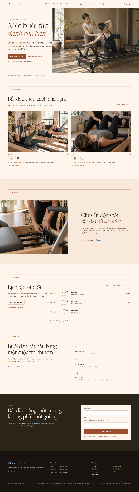
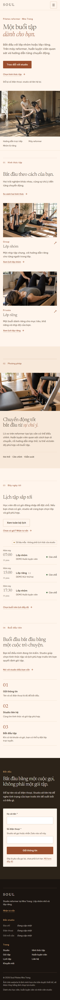
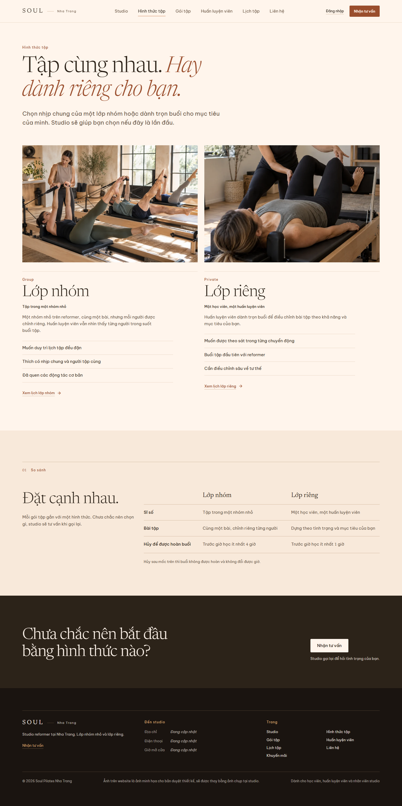
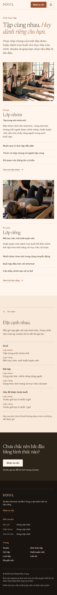
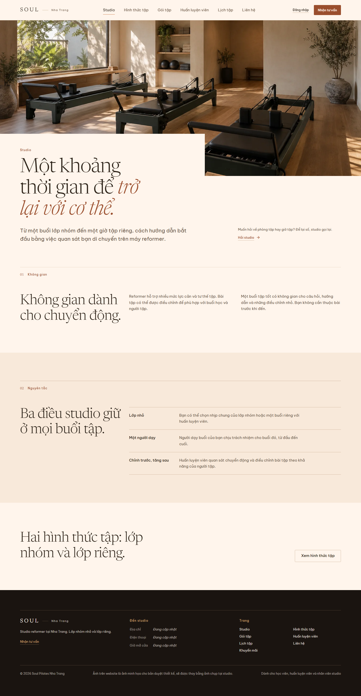
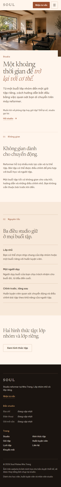
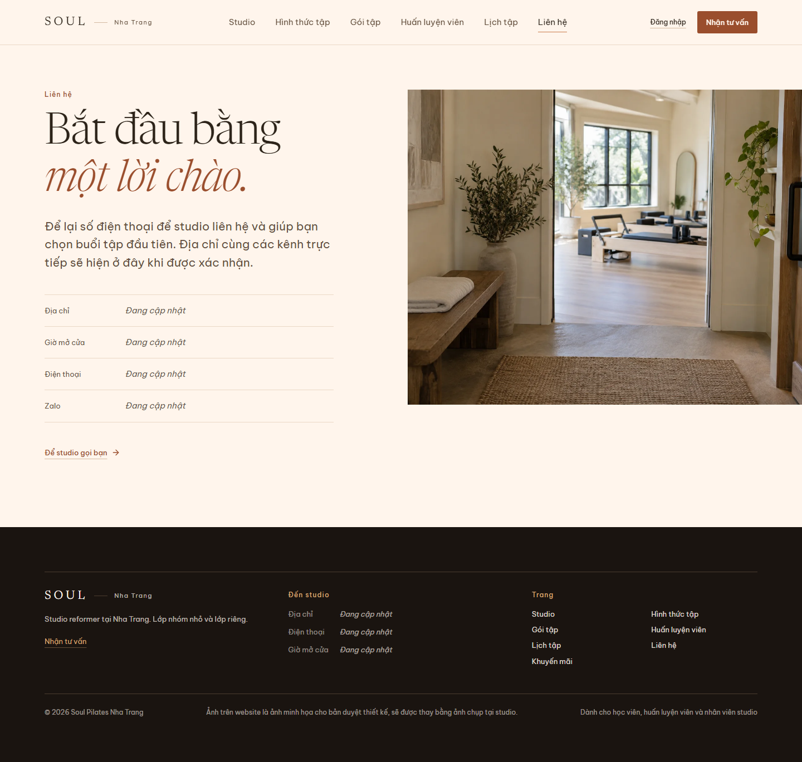
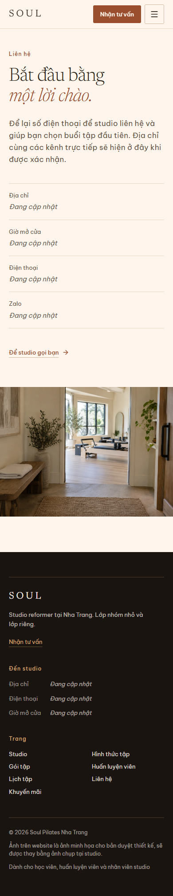

# Phiên bản từ audit Soul — 03/10/2026

Nhánh `codex/soul-audit-version`, phát triển từ bản Claude `ui/warm-measure` tại `035adae`. [Bản audit và lý do thiết kế](../../research/SOUL_DANANG_UI_UX_AUDIT_2026-10-03.md).

## Hướng thiết kế

Trang chủ đi theo hành trình **lời hứa → hai hình thức có ảnh chứng minh → cách tập → lịch → buổi đầu → để lại thông tin**. Ảnh hero cho thấy người hướng dẫn và người tập trong cùng một cảnh. Hai ảnh lớp nhóm/lớp riêng có cùng kích thước và trục để khách so sánh, không tạo một gallery rời rạc. Ảnh chi tiết máy chỉ đứng cạnh đoạn giải thích cách tập. Ảnh phòng là chủ thể của trang Studio. Ảnh lối vào đứng cạnh thông tin liên hệ.

Mỗi ảnh concept chỉ đóng vai trò duyệt bố cục, **không phải ảnh thật của cơ sở Nha Trang**. Thông báo này hiện một lần ở footer, không đặt caption lên từng ảnh. Cần chụp và thay ảnh thật trước khi public.

Phiên bản này giữ bảng màu be/cam/nâu của bản Claude, nhưng đổi thứ tự nội dung và bố cục ảnh: hero cân với phần giới thiệu; hai lựa chọn được trình bày bằng ảnh song song; phần lịch trên trang chủ rút còn ba buổi; phần buổi đầu rút thành ba bước; trang Hình thức tập bỏ bố cục hai ảnh lệch trục và rút bảng so sánh còn các thông tin quyết định.

## Ảnh chụp để duyệt

### Trang chủ

### Hình thức tập

### Studio

### Liên hệ

## Kiểm tra trước khi public

- Chủ cơ sở xác nhận tên thương hiệu Nha Trang, địa chỉ, bản đồ, điện thoại, Zalo và giờ mở cửa. Các ô hiện vẫn ghi “Đang cập nhật”.
- Chụp ảnh thật theo đúng vai trò và crop trong bản này; thay sáu ảnh concept trong `src_FE/public/images/concept/`.
- Lịch hiện hiển thị dữ liệu demo ở môi trường phát triển. Xác nhận dữ liệu thật, thông tin gói và nội dung lớp trước khi đưa khách vào luồng đặt lớp.
- Xác nhận số người tối đa và thời lượng buổi tập trước khi viết thành lời hứa trên trang công khai. Phiên bản này không mượn các con số đó từ Đà Nẵng.
